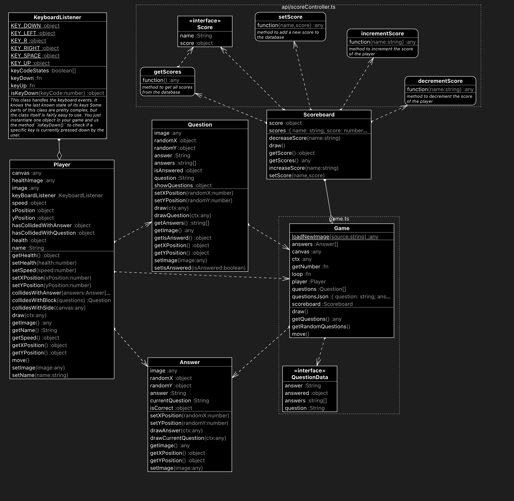

# MindQuiz

For our game we had to go to a school and ask the kids what features they wanted. Based on their feedback and ideas we came up with those requirements.

## Features

- [x] Ability to score points and see a scoreboard.
- [x] Hearts that you lose when answering incorrectly 
- [x] Option to set your own name and add colors to it.
- [x] Minecraft graphics in the game
- [ ] Music/sound effects on events like question etc.

